The following stages of image processing are followed:

Fig. 6.1: Stages of Image processing

**i. Image acquisition** 

Different images were acquired through the internet as well as through our phone cameras. Image in fig 1, 3 & 4 were acquired through our cameras while images in fig. 2 & 5 were taken from the internet. Each of these images were selected for their unique features such as the different types of characters, numbers and length of the number plate characters. 

These images are stored as imgOriginal in PyCharm and then, manipulated.

The different images are:

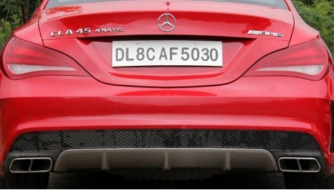

Fig. 6.2: License plate – DL 8C AF 5030

Fig. 6.3: License plate – MH 47 A 6493

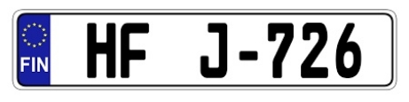

Fig. 6.4: License plate – HF J726

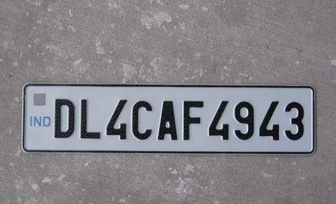

Fig. 6.5: License plate – DL 4C AF 4943

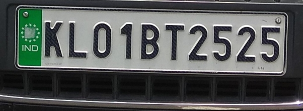

Fig. 6.6: License plate – KL 01 BT 2525

Each of the above license plates are taken as input and worked upon separately.

**ii. Pre-processing**

The original input images are first converted into grayscale images. 

A grayscale image is simply one in which the only colours are shades of gray. The reason for differentiating such images from any other sort of colour image is that less information needs to be provided for each pixel.

Fig. 6.7:  Grayscale for License plate – DL 8C AF 5030

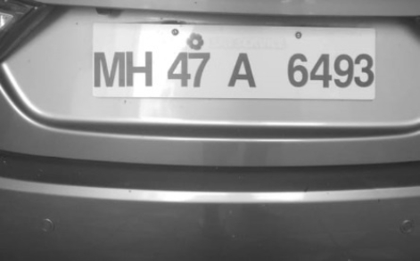

Fig. 6.8: Grayscale for License plate – MH 47 A 6493

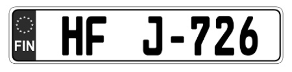

Fig. 6.9: Grayscale for License plate – HF J726

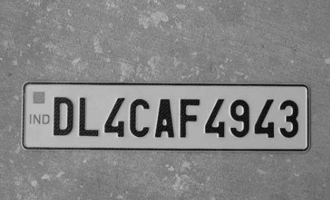

Fig. 6.10: Grayscale for License plate – DL 4C AF 4943

Fig. 6.11: Grayscale for License plate – KL 01 BT 2525

Further, the images are converted into binary images using thresholding. Binarization is a process in which, a threshold value is selected and the pixel intensity values lying above that threshold are given a 255 pixel intensity and the values lying below the threshold are given 0 pixel intensity. This method allows us to efficiently display the edges and boundaries present in the image. We have binarized the image to obtain the characters present on the number plate.

`	`Fig. 6.12: Binarized License plate – DL 8C AF 5030	

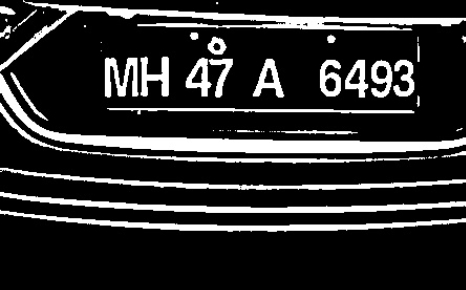

Fig. 6.13: Binarized License plate – MH 47 A 6493

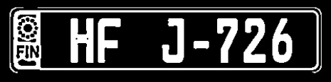

Fig. 6.14: Binarized License plate – HF J726

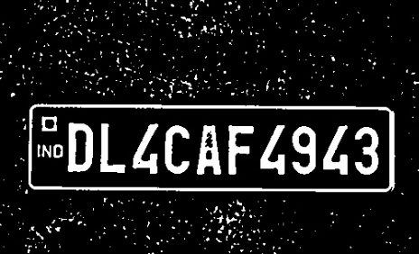

Fig. 6.15: Binarized License plate – DL 4C AF 4943

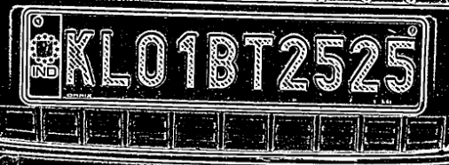

Fig. 6.16: Binarized License plate – KL 01 BT 2525

**iii. Techniques/algorithms applied** 

Once the input image has been pre-processed we proceed further by applying the following techniques/algorithms:

1. **Contour construction**

Once we obtain the binarized license plate image, we are finding the contours present in it with the help of cv2.findContours() function. As we know that a contour basically refers to the outline of an object, the cv2.findContours() function gives us the list of contours that it finds in the binarized license plate image. Then using the **PossibleCharsInScene()** function we find the possible characters present in the binarized image through the contours that have just been found and we construct the contours of the possible characters in scene with the help of **cv2.drawContours()** function as shown below:

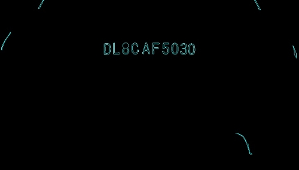
**
`		  `Fig. 6.17: Contour Construction of License plate – DL 8C AF 5030
**

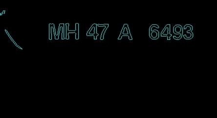

`   `Fig. 6.18: Contour Construction of License plate – MH 47 A 6493

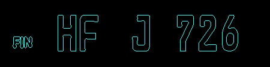

Fig. 6.19: Contour Construction of License plate – HF J726

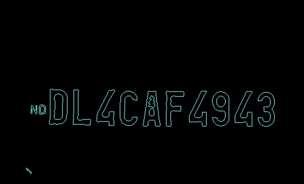

`      `Fig. 6.20: Contour Construction of License plate – DL 4C AF 4943

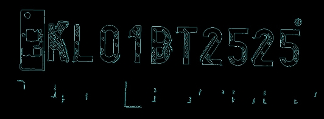

`      `Fig. 6.21: Contour Construction of License plate – KL 01 BT 2525

1. Once we have found the possible characters in the processed input image, we try to obtain the list of matching characters present in it because there can be different form of text which could be present in our image but we only require the license plate number text, thus we are trying to match the characters with each other and then cluster/append all the matching characters in one list. Thus we have laid out conditions which would supervise the matching of characters with each other such that the license plate number text gets clustered into one distinct cluster. The following parameters have been calculated and are being used in the laid out conditions:

- Finding the distance between two subsequent characters
- Finding the angle between two subsequent characters
- Finding the change in width of two subsequent characters
- Finding the change in height of two subsequent characters
- Finding the change in area of two subsequent characters

Fig. 6.22: Conditions to be satisfied

Once we obtain the list of matching characters in the license plate image we construct their contours with the help of **cv2.drawContours()** function as shown below:

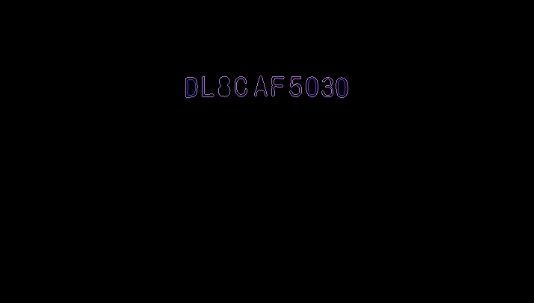

Fig. 6.23: List of Matching Characters of License plate – DL 8C AF 5030

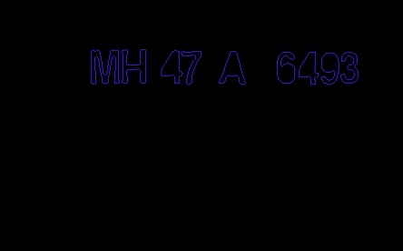

`        `Fig. 6.24: List of Matching Characters of License plate – MH 47 A 6493

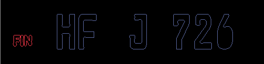

`       `Fig. 6.25: List of Matching Characters of License plate – HF J726

`          `Fig. 6.26: List of Matching Characters of License plate – DL 4C AF 4943

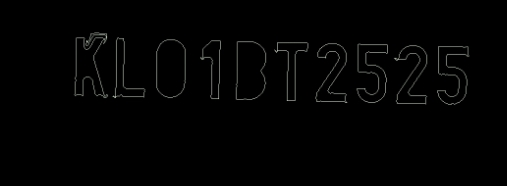

`   `Fig. 6.27: List of Matching Characters of License plate – KL 01 BT 2525

1. ` `**Region Of Interest (ROI) Extraction and KNN Classifier Algorithm**

After successfully obtaining the list of matching characters present in the license plate, we are extracting our region of interest (ROI) and passing it to the supervised machine learning algorithm KNN for classification purpose. The ROI is extracted and then resized and reshaped in order to ensure its accurate recognition by the KNN classifier. The highlighted ROI of different license plate images is shown below:

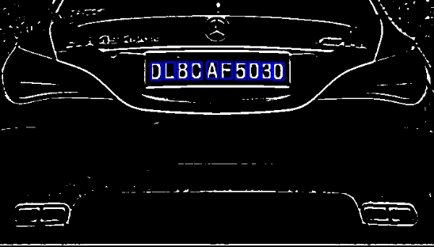

`                 `Fig. 6.28: ROI of License plate – DL 8C AF 5030

` 		                `Fig. 6.29: ROI of License plate – MH 47 A 6493

` `Fig. 6.30: ROI of License plate – HF J726

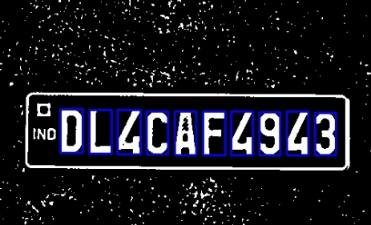

`  `Fig. 6.31: ROI of License plate – DL 4C AF 4943

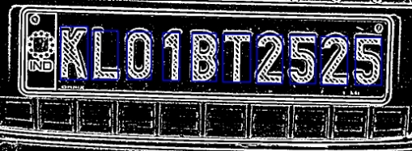

`    `Fig. 6.32: ROI of License plate – KL 01 BT 2525

**K-NN Classifier Algorithm**   

The KNN Algorithm is a supervised machine learning algorithm which is used to solve the classification model problems based on similarity measures. It is called a supervised machine learning algorithm because it relies on labelled input data to learn a function that produces an appropriate output when given new unlabelled data.

The KNN algorithm assumes that similar things exist in close proximity i.e. similar things are near to each other. K-nearest neighbour or K-NN algorithm basically creates an imaginary boundary to classify the data. When new data points come in, the algorithm will try to predict that to the nearest of the boundary line. Let us consider an example to understand how K-NN works:

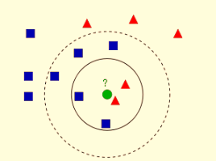

Fig. 6.33: Example of KNN

In the above image we can see that there are two families, red triangles and blue squares. These families or classes are present in their feature space where feature space is basically a space where our data objects are projected. Now let us suppose a new member i.e. the green circle comes into this feature space and needs to be added to either red or blue families. This process is called classification. So, one way is to check who is the nearest neighbour to the new member which we can see in the image is the red triangle family. Now even though the red triangle family is nearest to the new member the blue squares have more strength in that locality than the red triangles. So instead of just checking the nearest one we check the k nearest families. Then whoever is in majority among them, the new member belongs to that family. Thus, depending upon the value of k i.e. the number of nearest neighbours being taken, the result would vary and this is the basic idea behind classification in K-NN.

K-NN Training

Let us consider the image given below for training a K-NN model in order to understand it properly:

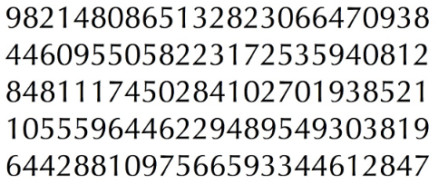

In order to prepare the data for training in OpenCV we follow these steps:

1) Load the train image
1) Select the digits through contour finding and applying the necessary constraints.
1) Draw a bounding rectangle around each letter and press the key on the keyboard manually corresponding to that letter in the box.
1) Once the corresponding digit key is pressed we resize the box and save some pixel values in an array and the corresponding manually entered digit in another array.
1) Finally, both the arrays are saved in separate txt files.

Once all the digits in the train image have been manually classified and labelled by us, the image would like this:

Now, for training the K-NN model we do the following:

1) Load both the txt files that have been saved earlier
1) Create an instance for the K-NN classifier
1) Make use of the kNearest.train() function to train the data

K-NN Testing

For testing the K-NN we do the following:

1) Once the training process is completed we simply load the image that has to be used for testing. 
1) We process the image and extract each digit with the help of contour methods and the necessary constraints.
1) We draw a bounding box around each digit, resize it to the same value which we did for in the train image and store its pixel values in some array.
1) Finally, we make use of the kNearest.findNearest() function to find the most closest or similar digit element in the trained data, classify the test element accordingly and based on that the assign the label of the class to which the test data has been classified into, to the test data. In this manner we can classify and find the predicted class of our test data based on how the data has been trained.

K-NN Pseudo code

1. Load the data.
1. Initialise the value of k i.e. the number of nearest neighbours.
1. For obtaining the predicted class, iterate through all the training data points.
   1. Calculate the distance between test data and each row of training data. Being the most popular method we can use Euclidean distance here as our distance metric.
   1. Sort the calculated distances in ascending order based on distance values.
   1. Obtain top k rows from the sorted array
   1. Obtain the most frequent class of these rows.
   1. Return the predicted class

**iv. Hurdles faced and its resolution** 

The Automatic License Plate Recognition System that we have implemented is a basic license plate recognition system, so the output of our system depends upon the image acquisition method used. When we were applying pre-processing method on the input image we observed that by taking the same value of pre-processing parameters like the adaptive threshold block size and adaptive threshold weight used in adaptive thresholding for all the input images, we were getting inaccurate results. 

For some input images the license plate characters which were being recognised by the KNN Classifier were getting wrongly recognized e.g. number 0 was being recognized as alphabet O and alphabet M was being recognized as alphabet H. Also for certain images the region of interest (ROI) which was being extracted did not contain the entire license plate number i.e. some numbers were not being captured in the ROI and as a result of this we were getting incorrect results from the KNN Classifier.

We tackled these issues by making changes in the pre-processing parameters, mainly the adaptive threshold block size and adaptive threshold weight. By making changes in these pre-processing parameters we were able to carry out the edge detection and feature extraction more effectively for each input image and ultimately obtained more accurate results.

**v. Post processing**

The Automatic License Plate Recognition System that we have implemented primarily focuses on obtaining the list of matching characters present in the license plate image and passing those list elements as the region of interest (ROI) to the supervised machine learning algorithm KNN for classification purpose. So, we are not carrying out any significant post processing operations in our Automatic License Plate Recognition System. However, when we extract the ROI we do resize and reshape it in order to ensure its accurate recognition by the KNN classifier. 

**vi. Final results.**

Once the KNN Classifier successfully recognises the characters present in our ROI, it returns the ascii values of the recognised characters which we later convert into characters using the **chr()** function. We then concatenate these characters into a predefined string and print this string as our final license plate number output as shown below:

`                 `Fig. 6.34: Output of License plate – DL 8C AF 5030

`                 `Fig. 6.35: Output of License plate – MH 47 A 6493

`     		     											`Fig. 6.36: Output of License plate – HF J726

 

`    `Fig. 6.37: Output of License plate – DL 4C AF 4943

`    `Fig. 6.38: Output of License plate – KL 01 BT 2525

# **7. Result analysis** 

For each of the below mentioned number plates, we had to vary the pre-processing parameters such as ADAPTIVE\_THRESH\_WEIGHT (ATW), ADAPTIVE\_THRESH\_BLOCK\_SIZE (ATBS) and MIN\_NUMBER\_OF\_MATCHING\_CHARS (M) by trial and error method.

We have obtained 100% accuracy for the following number plates:

- **DL 8C AF 5030**  (ATW =19, ATBS = 19 & M = 10)

Fig. 7.1: Output for DL 8C AF 5030 

- **MH 47 A 6493** (ATW = 3, ATBS = 7 & M = 9)

Fig. 7.2: Output for MH 47 A 6493

- **HF J726** (ATW = 7, ATBS = 19 & M = 6)

Fig. 7.3: Output for HF J726

For the following number plates, we have obtained inaccurate results (where one or more characters was incorrectly recognised or matched):

- **DL 4C AF 4943** (ATW = 7, ATBS = 19 & M = 10)

Output: DL 4C AF 4**8**43

Fig. 7.4: Output for DL 4C AF 4943

- **KL 01 BT 2525** (ATW = 3, ATBS = 19 & M = 6)

Output: KL 0**1** **8**T 2525

Fig. 7.5: Output for KL 01 BT 2525

Our algorithm does not restrict itself to just Indian Number plates but also works for European Number plates. Irrespective of the number of characters present in the number plate, our algorithm will detect it.

In the number plate DL 4C AF 4943, 9 was detected as 8 because there is a very similar resemblance of 8 with respect to the number plate thus, it was classified as 8. Analogously,  KL 01 BT 2525 was detected as KL 01 8T 2525 for the same reason. Inspite of changing the value of N in KNN, they were classified incorrectly. 

We also calculated the overall accuracy of the system for the five images which are present in the database. This accuracy was calculated by comparing the actual number plate characters with the number plate characters which were obtained after passing the input images through the ANPR system. We obtained 93.33% of accuracy for these images. 

 		Fig. 7.6: Accuracy of the system

